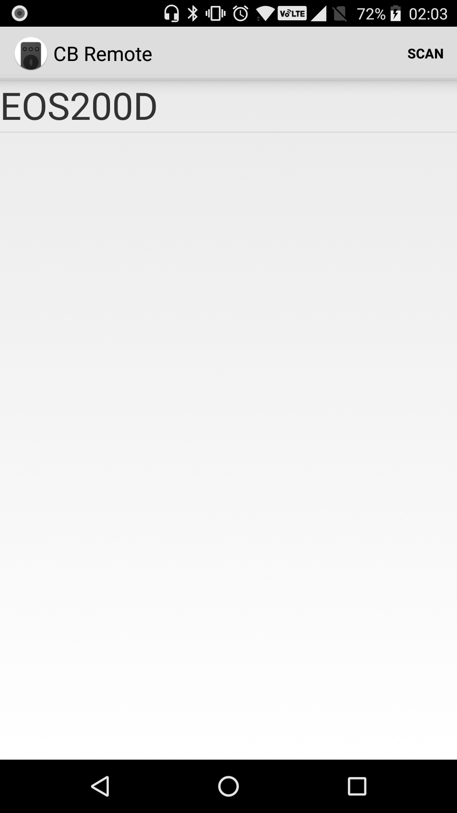
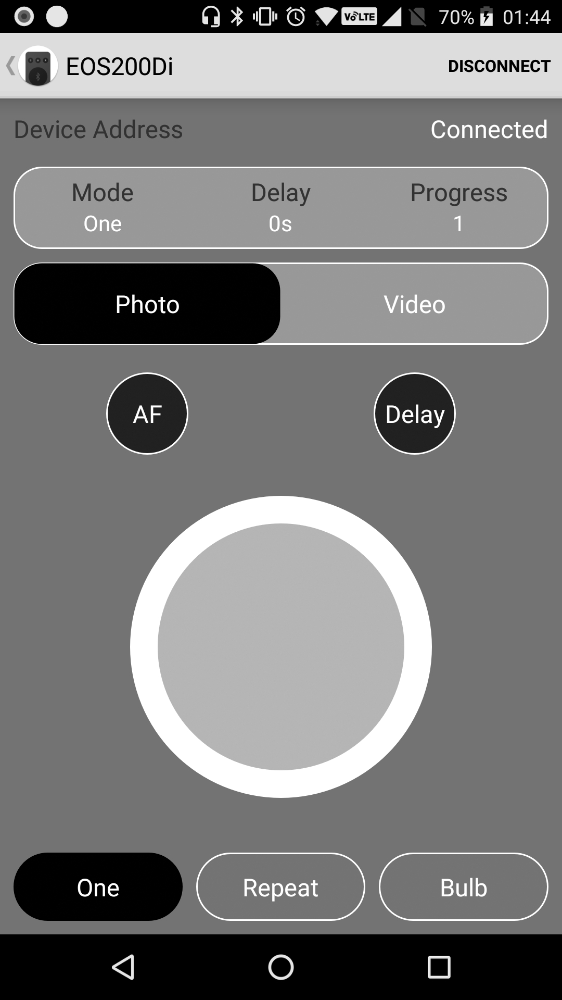

 

CB Remote
===================================

Android application to control supported Canon DSLR Cameras using Bluetooth LE. This app provides features similar to Canon's BR-E1 Bluetooth remote controller.

Introduction
------------

This app uses Bluetooth LE to connect your phone in remote mode to supported Canon DSLR Cameras.

Features
------------
1. Trigger instant shutter release.
1. Use headset button to trigger shutter button.
1. Delay timer shutter release.
1. Press and hold AF button.
1. Repeat(Intervalometer) mode (Experimental) - Take specified number of shots with specified interval in between shots.
1. Bulb mode - Take long exposure shots with in camera bulb mode.
1. Video mode.

Important Notes
------------
1. Depending on manufacturer, device settings or other task manager app some android devices may kill long running background services aggressively. Please check device settings. Please test it properly before using repeat, bulb(Auto) or video(auto) feature.
1. This app uses wakelock in repeat, bulb(Auto) and video(auto) mode which will cause battery drain.

Supported Canon Cameras
------------
1. Canon EOS 6D Mark II
1. Canon EOS 77D
1. Canon EOS 800D/Rebel T7i
1. Canon EOS 200D/Rebel SL2 (Tested)

Note: This app should work with any Canon camera that supports canon BR-E1 bluetooth remote.

Please create a PR to add another device if it is supported but not in this list.

Setup Instructions
------------
1. Set your camera's bluetooth function to "remote" mode.
1. Clear existing bluetooth paired devices from camera bluetooth settings.
1. Set your camera to bluetooth pairing mode and then select you camera's bluetooth name in the app to pair and connect.
1. Set your camera's "Drive Mode" to "Self-timer/Remote" mode. This will be found in drive mode list along with single, continuous, timer... etc modes.
1. To use bulb mode set camera's shutter speed to "Bulb".
1. Keep camera in one shot mode to use the apps "Repeat" mode.
1. The app can run in background during Repeat, Bulb(Auto) or Video(Auto) modes.

Screenshots
-------------

  

Build Instructions
---------------

Important: android.permission.ACCESS_COARSE_LOCATION is required to use Bluetooth for targetSdkVersion greater than 22

This project uses the Gradle build system. To build this project, use the
"gradlew build" command or use "Import Project" in Android Studio.

Support
-------

- To be added

If you've found an error in this app, please file an issue:
https://github.com/iebyt/cbremote

email - contact[at]iebyt.com

Patches are encouraged, and may be submitted by forking this project and
submitting a pull request through GitHub. Please see CONTRIBUTING.md for more details.

References
-------

Motiviations for this app: My Canon 200D and awesome resources mentioned below.

1. https://iandouglasscott.com/2017/09/04/reverse-engineering-the-canon-t7i-s-bluetooth-work-in-progress/
1. https://github.com/googlesamples/android-BluetoothLeGatt

License
-------

Copyright 2018 iebyt.com

Licensed to the Apache Software Foundation (ASF) under one or more contributor
license agreements.  See the NOTICE file distributed with this work for
additional information regarding copyright ownership.  The ASF licenses this
file to you under the Apache License, Version 2.0 (the "License"); you may not
use this file except in compliance with the License.  You may obtain a copy of
the License at

http://www.apache.org/licenses/LICENSE-2.0

Unless required by applicable law or agreed to in writing, software
distributed under the License is distributed on an "AS IS" BASIS, WITHOUT
WARRANTIES OR CONDITIONS OF ANY KIND, either express or implied.  See the
License for the specific language governing permissions and limitations under
the License.
